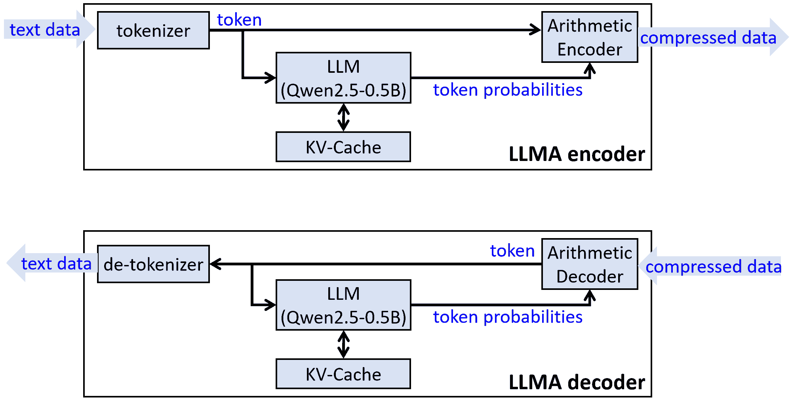

 

# LLMA

#### What is LLMA?

**LLMA** = **LLM** (Large Language Model) + **A**rithmetic coder, which use LLM to do text data compression.

　

|  |
| :---------------------: |
| **Figure**: block diagram of LLMA |

　

#### Insight:

The causal LLMs can output the probabilities of current token according to the previous tokens. This repo is an interesting attempt: adding an arithmetic encoder after an LLM, which encodes the token according to its probability to achieve text data compression.

#### Pros:

- Very high compression ratio which can beat the sota [**CMIX**](https://www.byronknoll.com/cmix.html) (and of course [**XZ**](https://tukaani.org/xz/format.html), [**GZIP**](https://www.gnu.org/software/gzip/), BZIP, etc.)

#### Cons:

- Very very slow: ~16 bytes per second on CPU using [Qwen2.5-0.5B](https://huggingface.co/Qwen/Qwen2.5-0.5B) model.
- Numerical instability: Since LLM inference involves floating point operations, It cannot guarantee that the compressed data generated by a machine can be successfully decompressed on another machine.

#### Test result:

The test text is [data/data.txt](./data/data.txt), which is the content of Matt Mahoney's book [Data Compression Explained](https://mattmahoney.net/dc/dce.html).

| Compression Method                                          | Compressed Size | Compress command |
| :---------------------------------------------------------: | --------------: | :--------------- |
| **LLMA** (Qwen2.5-0.5B)                                     | **32927** B     | `python LLMA.py -c data.txt data.llma` |
| [**CMIX**](https://www.byronknoll.com/cmix.html) (ver. 21)  |   55960 B       | `cmix.exe -t dictionary\english.dic data.txt data.cmix` |
| [**LPAQ8**](https://mattmahoney.net/dc/#lpaq) (-9)          |   68765 B       | `LPAQ8.exe -9 data.txt data.lpaq8`   |
| [**XZ**](https://tukaani.org/xz/format.html) (LZMA) (-9 -e) |   86708 B       | `xz -zkvf -9 -e data.txt` (in Linux) |
| [**GZIP**](https://www.gnu.org/software/gzip/)  (-9)        |  101497 B       | `gzip -kvf -9 data.txt` (in Linux)   |
| Uncompressed                                                |  294328 B       |                                      |

　

# Usage

To download the pre-trained LLM model, you need to register [Huggingface](https://huggingface.co) and apply for a "read" token.

Then, set your "read" token in `download_pretrained_model.py`.

Then run following command to download the [Qwen2.5-0.5B](https://huggingface.co/Qwen/Qwen2.5-0.5B) model to local. The model parameter is about 953 MB.

```powershell
python download_pretrained_model.py
```


Then run following command to compress a `.txt` file to a `.llma` file:

```powershell
python LLMA.py -c <input_name>.txt <output_name>.llma
```


Run following command to decompress a `.llma` file to a `.txt` file:

```powershell
python LLMA.py -d <output_name>.txt <input_name>.llma
```
